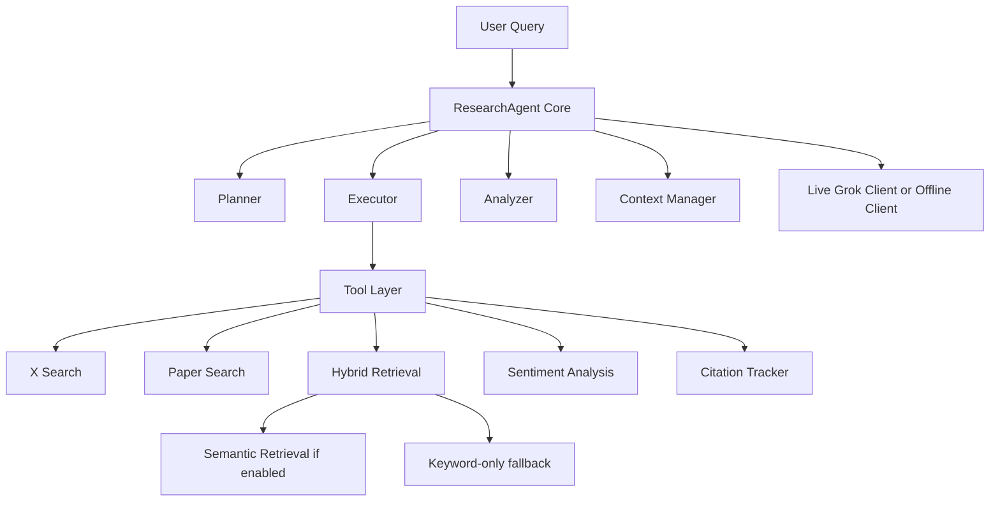

# Agentic Research Workflow with Grok

[](https://github.com/Kylinny/agentic-research-workflow)
[](https://www.python.org/)
[](https://x.ai/)

A reproducible AI agent workflow for research-style queries across X-style discourse and research-paper datasets.

This project is designed and packaged like an **AI backend / agent systems** project, not just a chat demo. It focuses on:
- multi-step planning, execution, analysis, and synthesis
- tool orchestration across heterogeneous local datasets
- deterministic offline demos without live model credentials
- graceful degradation when semantic retrieval backends are unavailable
- local benchmark and regression coverage for repeatable iteration

**🔗 GitHub Repository**: https://github.com/Kylinny/agentic-research-workflow

## Why This Project

Many agent demos look impressive but are hard to reproduce locally because they depend on API keys, unstable model behavior, or brittle retrieval pipelines. This repository turns that problem into an engineering exercise: build an agent workflow that still runs, benchmarks, and demos cleanly even when parts of the runtime are unavailable.

## Showcase

Open the full sample here: [examples/sample_output.md](examples/sample_output.md)

## Quick Demo

```bash
# 1. Create a Python 3.10+ environment
python3.10 -m venv .venv310
source .venv310/bin/activate
pip install -r requirements.txt

# 2. Run the offline workflow
python main.py --offline --query "How does X discourse on biotechnology compare to academic research?"

# 3. Run the offline regression suite
python -m unittest discover -s tests

# 4. Run a small offline benchmark
python evaluation/run_benchmark.py --offline --max-queries 2
```

## Overview

The workflow supports:
- **Planning**: break complex research questions into executable tasks
- **Execution**: run retrieval and analysis tools with dependency-aware orchestration
- **Analysis**: score intermediate results for quality and completeness
- **Synthesis**: generate a final structured answer from tool outputs
- **Offline reproducibility**: run demos and benchmarks without a live xAI key
- **Retrieval fallback**: degrade from semantic retrieval to keyword-only mode when needed

## What Makes It Useful

- **Good for demos**: `--offline` mode makes the workflow easy to show without external setup
- **Good for iteration**: regression tests and benchmark scripts catch breakage quickly
- **Good for storytelling**: the architecture highlights agent control flow, retrieval design, and runtime resilience

## Features

### 🤖 Agentic Workflow
- Iterative loop: plan → decompose → select tools → analyze → refine → summarize
- Context-aware decision making with multi-step memory
- Adaptive replanning when encountering ambiguous or insufficient results
- Tool chaining for complex multi-hop reasoning

### 📊 Mock Datasets
- **X (Twitter) Data**: Real-time style posts with replies, threads, timestamps, and engagement metrics
- **Research Papers**: Structured documents with abstracts, methodologies, results, and citations
- Realistic noise, sarcasm detection challenges, and multilingual content

### 🔍 Hybrid Retrieval System
- Semantic search using sentence transformers
- Keyword-based retrieval for precise matching
- FAISS-powered vector indexing for scalability
- Cross-document analysis and citation tracking

### 🧠 Grok Integration
- Multiple model variants (grok-beta, grok-2-latest, etc.)
- Optimized prompting for planning and reasoning
- Error handling and retry logic
- Token-aware context management

### 📈 Evaluation Framework
- 20-40 complex research queries
- Metrics: completion rate, step efficiency, answer quality
- Comparative analysis across Grok model variants
- Automated benchmarking

## Quick Start

### Using Docker (Recommended)

```bash
# Clone the repository
git clone https://github.com/Kylinny/agentic-research-workflow.git
cd agentic-research-workflow

# Set up your API key
cp .env.example .env
# Edit .env and add your X.AI API key

# Build and run
docker-compose up --build
```

### Local Installation

```bash
# Clone the repository
git clone https://github.com/Kylinny/agentic-research-workflow.git
cd agentic-research-workflow

# Create virtual environment
python3 -m venv venv
source venv/bin/activate  # On Windows: venv\Scripts\activate

# Install dependencies
pip install -r requirements.txt

# Set up environment variables
cp .env.example .env
# Edit .env and add your X.AI API key

# Generate datasets
python scripts/generate_datasets.py

# Run the agent
python main.py --query "What are the latest trends in AI safety research?"
```

## Usage

### Running the Agent

```bash
# Interactive mode
python main.py --interactive

# Single query
python main.py --query "Analyze the sentiment around recent AI regulation discussions"

# Batch evaluation
python evaluation/run_benchmark.py

# Compare models
python evaluation/compare_models.py
```

### Offline Demo Mode

```bash
# Run the full workflow without an xAI API key
python main.py --offline --query "Compare public discourse and research trends in AI safety"

# Run a small offline benchmark
python evaluation/run_benchmark.py --offline --max-queries 3
```

Offline mode uses a deterministic heuristic client so you can demo planning, tool execution, and synthesis locally before wiring in a live model.

### Run Regression Tests

```bash
python -m unittest discover -s tests
```

### Example Queries

```bash
# X Data Analysis
python main.py --query "What are users saying about climate change? Identify key influencers and sentiment trends over time."

# Research Paper Analysis
python main.py --query "Compare methodologies used in transformer architecture papers from 2017-2023. What are the key innovations?"

# Cross-domain
python main.py --query "How does public discourse on X about quantum computing align with academic research?"
```

## Architecture



## Project Structure

```
Xai/
├── agent/
│   ├── __init__.py
│   ├── core.py              # Main agent loop
│   ├── planner.py           # Task decomposition & planning
│   ├── executor.py          # Tool execution
│   ├── analyzer.py          # Result analysis & refinement
│   └── context_manager.py   # Context & memory management
├── grok/
│   ├── __init__.py
│   ├── client.py            # Grok API client
│   ├── prompts.py           # Optimized prompts
│   └── models.py            # Model configurations
├── tools/
│   ├── __init__.py
│   ├── x_search.py          # X data retrieval
│   ├── paper_search.py      # Research paper search
│   ├── sentiment.py         # Sentiment analysis
│   ├── citations.py         # Citation tracking
│   └── hybrid_retrieval.py  # Hybrid search engine
├── data/
│   ├── x_posts.json         # Generated X data
│   ├── research_papers.json # Generated papers
│   └── embeddings/          # Vector indices
├── evaluation/
│   ├── queries.json         # Test queries
│   ├── run_benchmark.py     # Evaluation script
│   ├── compare_models.py    # Model comparison
│   └── metrics.py           # Evaluation metrics
├── scripts/
│   └── generate_datasets.py # Dataset generation
├── Dockerfile
├── docker-compose.yml
├── main.py
├── requirements.txt
└── README.md
```

## Evaluation Metrics

The system tracks:
- **Completion Rate**: % of queries successfully answered
- **Step Efficiency**: Average steps per query
- **Answer Quality**: Relevance, coherence, citation accuracy
- **Replanning Rate**: Frequency of adaptive replanning
- **Context Utilization**: Effective use of conversation history

## Troubleshooting

See [TROUBLESHOOTING.md](docs/TROUBLESHOOTING.md) for common issues and solutions.

## Documentation

- [Technical Documentation](docs/TECHNICAL.md) - Architecture and design decisions
- [Troubleshooting Guide](docs/TROUBLESHOOTING.md) - Common issues and solutions

## License

MIT License - See LICENSE file for details.

## Promo Code

Use promo code `grok_eng_9a9e9f2a` on console.x.ai for $20 in free credits.
